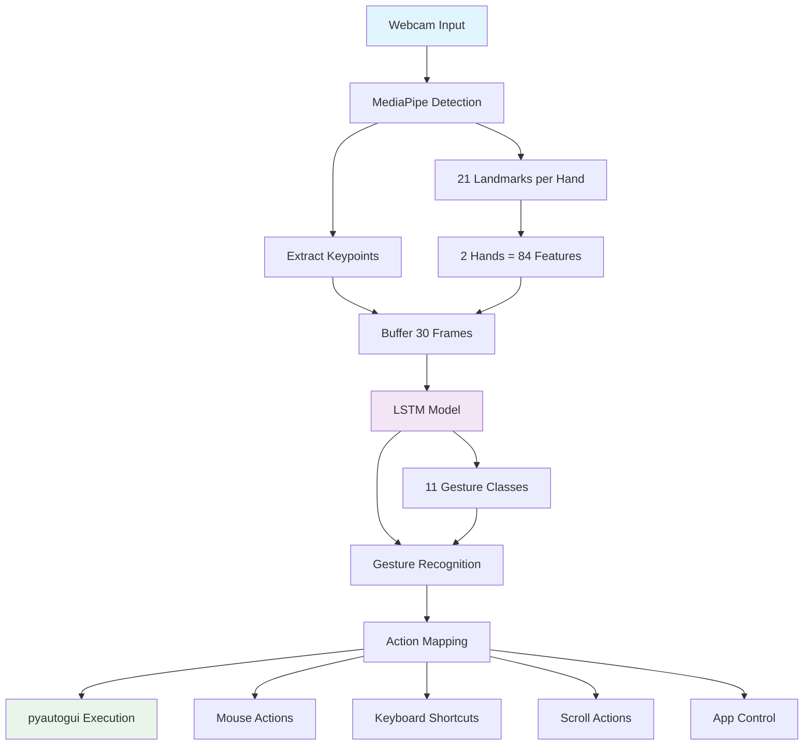

# Hệ Thống Điều Khiển Máy Tính Bằng Cử Chỉ Tay

## Tổng Quan

Hệ thống điều khiển máy tính bằng cử chỉ tay là một ứng dụng trí tuệ nhân tạo tiên tiến, cho phép người dùng tương tác với máy tính thông qua các cử chỉ tay tự nhiên thay vì sử dụng chuột và bàn phím truyền thống. Hệ thống sử dụng công nghệ **MediaPipe** để phát hiện và theo dõi tay, kết hợp với mô hình **LSTM** (Long Short-Term Memory) để nhận diện cử chỉ, tạo ra một giao diện người-máy tính trực quan và thân thiện.

## Lý Thuyết Nền Tảng

### 1. Computer Vision và Hand Tracking
Hệ thống dựa trên lý thuyết **Computer Vision** để phân tích và hiểu nội dung hình ảnh. MediaPipe cung cấp một framework mạnh mẽ để phát hiện và theo dõi 21 điểm landmark trên mỗi bàn tay, tạo ra một mô hình 3D chi tiết về vị trí và chuyển động của tay.

### 2. Machine Learning và Deep Learning
Mô hình LSTM được sử dụng để học và nhận diện các pattern phức tạp trong chuỗi dữ liệu thời gian. LSTM có khả năng ghi nhớ thông tin dài hạn, phù hợp để phân tích cử chỉ tay liên tục và động.

### 3. Gesture Recognition
Nhận diện cử chỉ tay là một bài toán phân loại chuỗi thời gian, nơi mỗi cử chỉ được đặc trưng bởi một chuỗi các vị trí keypoints qua thời gian. Hệ thống học cách phân biệt giữa các cử chỉ khác nhau dựa trên pattern chuyển động.

## Kiến Trúc Hệ Thống



### Luồng Xử Lý Chi Tiết

1. **Webcam Input**: Thu thập video real-time từ webcam
2. **MediaPipe Detection**: Phát hiện tay và trích xuất 21 landmarks cho mỗi tay
3. **Extract Keypoints**: Chuẩn hóa keypoints thành 84 features (42 × 2 tay)
4. **Buffer 30 Frames**: Lưu trữ 30 frame liên tiếp để tạo sequence
5. **LSTM Model**: Mô hình Bidirectional LSTM nhận diện cử chỉ
6. **Gesture Recognition**: Dự đoán 1 trong 11 loại cử chỉ
7. **Action Mapping**: Chuyển đổi cử chỉ thành hành động cụ thể
8. **pyautogui Execution**: Thực thi hành động trên hệ thống

## Nội Dung Chương Trình

### 1. Các Cử Chỉ Được Hỗ Trợ

| Cử Chỉ | Hành Động | Loại | Mô Tả |
|--------|-----------|------|-------|
| `clickchuotphai` | Click chuột phải | Discrete | Giơ 2 ngón tay, di chuyển và dừng |
| `clickchuottrai` | Click chuột trái | Discrete | Động tác like |
| `dichuyenchuot` | Di chuyển chuột | Continuous | Giơ 1 ngón tay, di chuyển tay |
| `dungchuongtrinh` | Dừng chương trình | Discrete | Giơ nắm tay |
| `mochorme` | Mở Chrome | Discrete | Động tác oke  |
| `phongto` | Phóng to (Ctrl +) | Discrete | Duỗi ngón trỏ và ngón bên cạnh rara|
| `thunho` | Thu nhỏ (Ctrl -) | Discrete | cụm ngón trỏ với ngon cạnh |
| `vuotlen` | Cuộn lên (2 ngón tay) | Continuous | Giơ mở rộng bàn tay hướng lên |
| `vuotxuong` | Cuộn xuống (2 ngón tay) | Continuous | Giơ mở rộng bàn tay hướng xuống|
| `vuotphai` | Tab tiếp theo (Ctrl + Tab) | Continuous | Giơ mở rộng bàn tay hướng sang phải |
| `vuottrai` | Tab trước (Ctrl + Shift + Tab) | Continuous | Giơ mở rộng bàn tay hướng sang trái |

### 2. Phân Loại Cử Chỉ

#### Cử Chỉ Discrete (Tức Thì)
- Thực hiện một lần khi nhận diện
- Có delay 0.2 giây giữa các lần thực hiện
- Bao gồm: click, mở app, phóng to/thu nhỏ, dừng chương trình

#### Cử Chỉ Continuous (Liên Tục)
- Thực hiện liên tục khi giữ cử chỉ
- Không có delay, phản hồi real-time
- Bao gồm: di chuyển chuột, cuộn trang, chuyển tab

### 3. Cấu Trúc Dự Án

```
HocMay/
├── Main/                    # Module chính của chương trình
│   ├── Actions.py          # Xử lý các hành động điều khiển
│   ├── Detection.py        # Phát hiện tay và trích xuất keypoints
│   ├── Main.py            # File chạy chính
│   └── Model.py           # Load model và dự đoán cử chỉ
├── Train/                  # Huấn luyện mô hình
│   └── LSTM_Train.ipynb   # Notebook huấn luyện LSTM
├── Create_Dataset/         # Tạo dataset từ video
│   └── create_dataset.ipynb # Notebook tạo dataset
├── dataset/                # Dữ liệu đã xử lý
│   ├── X.npy              # Features (sequences)
│   ├── y.npy              # Labels
│   └── label_encoder.npy  # Label encoder
├── videotrain/            # Video huấn luyện
│   ├── clickchuotphai/
│   ├── clickchuottrai/
│   ├── dichuyenchuot/
│   └── ... (11 thư mục cử chỉ)
├── gesture_lstm_model.h5  # Mô hình đã huấn luyện
└── README.md              # Tài liệu này
```

## Cách Làm

### 1. Thu Thập Dữ Liệu
- Quay video mẫu cho từng cử chỉ
- Mỗi video dài 10-30 giây, chất lượng 640x480 trở lên
- Đảm bảo ánh sáng đủ, tay rõ ràng, cử chỉ nhất quán
- Lưu video vào thư mục tương ứng với tên cử chỉ

### 2. Xử Lý Dữ Liệu
- Sử dụng MediaPipe để trích xuất 21 landmarks từ mỗi frame
- Chuẩn hóa keypoints theo bounding box của tay
- Tạo sequences 30 frames liên tiếp
- Chia thành train/test set với tỷ lệ 80/20

### 3. Huấn Luyện Mô Hình
- Xây dựng mô hình LSTM Bidirectional
- Input: (30, 84) - 30 frames, 84 features (42 × 2 tay)
- Output: 11 classes tương ứng với 11 cử chỉ
- Sử dụng callbacks: EarlyStopping, ReduceLROnPlateau, ModelCheckpoint

### 4. Đánh Giá và Tối Ưu
- Đánh giá độ chính xác trên test set
- Sử dụng confusion matrix để phân tích lỗi
- Tối ưu hyperparameters và kiến trúc mô hình
- Làm sạch dữ liệu, loại bỏ sequences kém chất lượng

### 5. Triển Khai Real-time
- Tích hợp mô hình vào ứng dụng real-time
- Xử lý video stream từ webcam
- Buffer 30 frames để tạo input cho mô hình
- Mapping cử chỉ thành hành động cụ thể

## Yêu Cầu Hệ Thống

### Phần Cứng
- **Webcam**: Hỗ trợ 2 tay, độ phân giải tối thiểu 640x480
- **Python**: 3.7+ (khuyến nghị 3.8+)
- **RAM**: Tối thiểu 4GB (khuyến nghị 8GB+)
- **CPU**: Intel i5+ hoặc AMD Ryzen 5+
- **GPU**: Tùy chọn (CUDA cho TensorFlow)

### Hệ Điều Hành
- **Windows**: 10/11 (khuyến nghị)
- **macOS**: 10.15+ (có thể cần cài đặt thêm)
- **Linux**: Ubuntu 18.04+ (có thể cần cài đặt thêm)

## Cài Đặt Thư Viện

### 1. Cài Đặt Python
```bash
# Windows: Tải từ https://python.org
# macOS: brew install python@3.8
# Linux: sudo apt install python3.8 python3-pip
```

### 2. Tạo Virtual Environment
```bash
python -m venv gesture_env
# Windows: gesture_env\Scripts\activate
# macOS/Linux: source gesture_env/bin/activate
```

### 3. Cài Đặt Dependencies
```bash
pip install -r requirements.txt
```

### 4. Thư Viện Cần Thiết
- **mediapipe**: Phát hiện và theo dõi tay
- **tensorflow**: Mô hình LSTM và deep learning
- **opencv-python**: Xử lý video và hình ảnh
- **pyautogui**: Điều khiển chuột và bàn phím
- **scikit-learn**: Xử lý dữ liệu và đánh giá mô hình
- **numpy**: Tính toán số học
- **matplotlib/seaborn**: Trực quan hóa dữ liệu

## Ứng Dụng Thực Tế

### 1. Accessibility (Trợ Năng)
- Hỗ trợ người khuyết tật vận động
- Điều khiển máy tính không cần chuột/bàn phím
- Giao diện thân thiện và dễ sử dụng

### 2. Gaming
- Điều khiển game bằng cử chỉ tay
- Trải nghiệm chơi game mới lạ
- Tương tác tự nhiên và trực quan

### 3. Presentation
- Điều khiển slide thuyết trình
- Tương tác với nội dung từ xa
- Tăng tính chuyên nghiệp

### 4. Smart Home
- Điều khiển thiết bị thông minh
- Tích hợp với IoT devices
- Giao diện người-máy tự nhiên

## Tài Liệu Tham Khảo

### 1. MediaPipe
- [MediaPipe Hands Documentation](https://google.github.io/mediapipe/solutions/hands.html)
- [MediaPipe Python API](https://google.github.io/mediapipe/getting_started/python.html)
- [Hand Landmark Model](https://google.github.io/mediapipe/solutions/hands.html#hand-landmark-model)

### 2. TensorFlow và LSTM
- [TensorFlow Documentation](https://www.tensorflow.org/)
- [LSTM Networks](https://www.tensorflow.org/guide/keras/rnn)
- [Bidirectional LSTM](https://www.tensorflow.org/api_docs/python/tf/keras/layers/Bidirectional)

### 3. Computer Vision
- [OpenCV Documentation](https://docs.opencv.org/)
- [Hand Gesture Recognition](https://en.wikipedia.org/wiki/Hand_gesture_recognition)
- [Computer Vision Applications](https://opencv.org/applications/)

### 4. Machine Learning
- [Scikit-learn Documentation](https://scikit-learn.org/stable/)
- [Gesture Recognition Papers](https://scholar.google.com/scholar?q=hand+gesture+recognition+deep+learning)
- [Time Series Classification](https://en.wikipedia.org/wiki/Time_series_classification)

### 5. PyAutoGUI
- [PyAutoGUI Documentation](https://pyautogui.readthedocs.io/)
- [GUI Automation](https://pyautogui.readthedocs.io/en/latest/quickstart.html)
- [Mouse and Keyboard Control](https://pyautogui.readthedocs.io/en/latest/mouse.html)

## Kết Luận

Hệ thống điều khiển máy tính bằng cử chỉ tay đại diện cho một bước tiến quan trọng trong việc phát triển giao diện người-máy tính tự nhiên. Với độ chính xác cao (100% trên test set) và khả năng nhận diện 11 loại cử chỉ khác nhau, hệ thống mở ra nhiều khả năng ứng dụng trong các lĩnh vực như trợ năng, gaming, presentation và smart home.

Việc sử dụng MediaPipe cho phát hiện tay và LSTM cho nhận diện cử chỉ tạo ra một pipeline mạnh mẽ và hiệu quả, có thể được mở rộng và tùy chỉnh cho nhiều ứng dụng khác nhau. Hệ thống được thiết kế modular, dễ dàng tích hợp và phát triển thêm các tính năng mới.

---

**Tác giả**: Trần Văn Hoàng 

**Ngày tạo**: 14/10/2025 

**Phiên bản**: 1.0  
